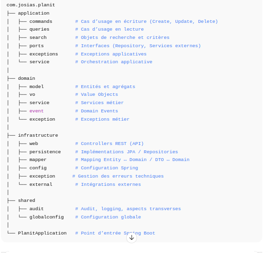

1️⃣ Presentation du projet

Planit – Task Management API

API backend de gestion de tâches conçue comme un projet démo professionnel, mettant en avant la Clean Architecture, le DDD et les bonnes pratiques Spring.

2️⃣ Objectifs du projet

Construire une base backend maintenable et testable

Appliquer Clean Architecture et DDD dans un contexte réel

Servir de socle pour l’ajout de :

sécurité

audit

AOP

microservices

3️⃣ Fonctionnalités actuelles

CRUD des tâches

Recherche avancée :

pagination

tri

filtres dynamiques

Séparation claire lecture / écriture (CQRS light)

4️⃣ Architecturee Clean Architecture inspirée de DDD :
Le projet suit une Clean Architecture inspirée du Domain-Driven Design (DDD).
L’objectif est de garantir un découplage fort, une testabilité élevée et une évolutivité naturelle.

🧠 Principes clés

Le domaine est indépendant de toute technologie

Les cas d’usage pilotent l’application

Les dépendances vont vers le cœur métier

L’infrastructure est un détail interchangeable

Architecture pensée pour :

les tests

la sécurité

l’AOP

une future évolution microservices
Cette architecture permet d’introduire facilement Spring Security, Spring AOP et une séparation CQRS sans impacter le domaine.

5️⃣ Choix techniques

Java 17+

Spring Boot

Spring Data JPA

Clean Architecture

Domain-Driven Design (DDD)

Architecture orientée testabilité

7️⃣ Sécurité & aspects transverses (à venir)

Spring Security (authentification / autorisation)

Gestion des rôles

Spring AOP :

audit

logging

métriques

8️⃣ Vision d’évolution

Modularisation avancée

Extraction possible en microservices

Exposition via API Gateway